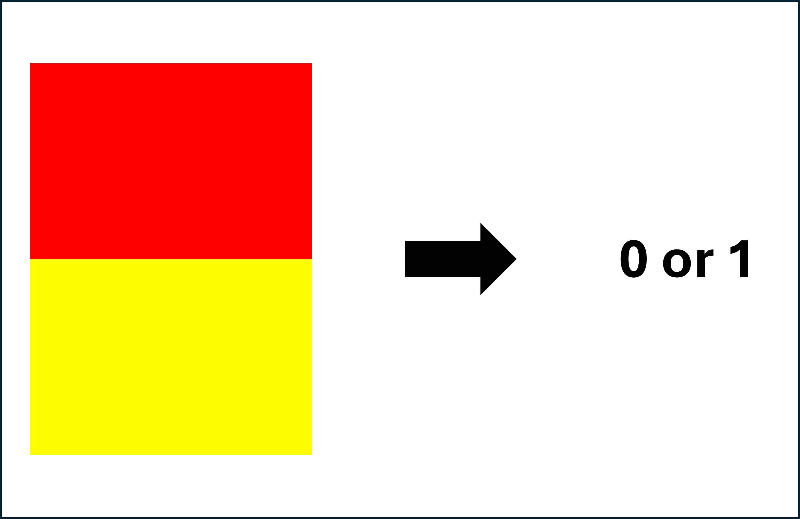
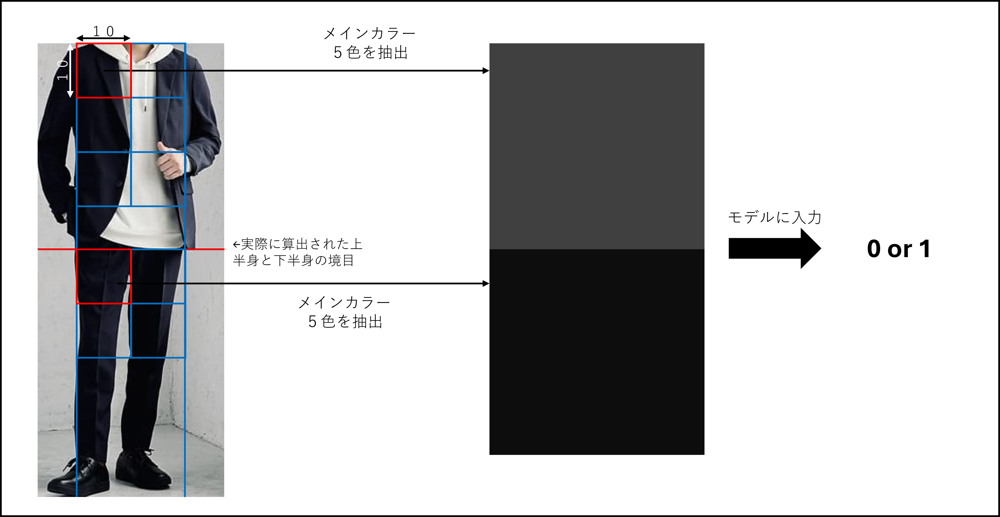

# 配色最適AI

## 使用技術


## 概要

このAIは服装の配色が最適かを判定するAIです。追加課題の内容的には改善案を提案する機能もありましたが、改善案を提案するNNを作成しましが、精度が低かったため今回は未実装です。

メインファイルはmain.ipynbとなっています。実行は[Google Colaboratory](https://colab.research.google.com/?hl=jav)上でお願いします。また実行には学習済みモデルであるmodel.savを読み込む必要があります。

## 開発方法について

今回のモデル作成にあたって服を着た画像を訓練データにするのはデータの収集の難易度が高かったため、2色の色から配色の適正を判定するモデルを作成しました。アルゴリズムにサポートベクターマシン（SVM）を使用したのは入力、出力ともに単純であり、少ないデータ量で高い精度を実現できるからです。



### 1. 訓練データの作成

学習には最適な配色のRGB情報が大量に必要です。そこで今回は[Instagram](https://www.instagram.com/p/CuR6iabPKpM/)の投稿を参考にさせていただきました。この情報を基にGoogleスプレッドシート上にGASを使用して最適な配色のRGBのリストを作成しました。また大量に情報を用意するために[原色大辞典](https://www.colordic.org/)を参考にして色の幅を広げました。実際のデータは[こちら](https://docs.google.com/spreadsheets/d/1uuhuLIn7eqbdxlbImq0IiGHr3MFUXdbL-D7w9zcdtNE/edit?usp=sharing)です。また最適でない配色に関するデータもGASを使用して作成しました。下記コードはGASのコードです。

```js :GoogleAppsScript
//スプレッドシートに接続
const connect = () => {
  const sheet = SpreadsheetApp.getActiveSheet();

  return sheet;
}

//背景色を塗りつぶす関数
const setBackground = (sheet, pos, color) => {
  sheet.getRange(pos["y"], pos["x"]).setBackground(color)
}

//乱数生成
const random = () => {
  return Math.floor(Math.random() * 140)
}

//カラーコードをRGBに変換
const getRgbFromColorCode = (colorCode) => {
    var rgb = String(colorCode.slice(1).match(/.{2}/g).map(hex => parseInt(hex, 16)));

    return rgb.split(",")
}

//原色大辞典からカラーコードを取得
const getColorCode = (url) => {
  let response = UrlFetchApp.fetch(url);
  let content = response.getContentText("utf-8");

  let html = Parser.data(content);

  var color_code = html.from('<td style="background-color:').to('">').iterate();

  console.log(color_code)
  
  return color_code;
}

//Instagramを参考に最適な色の組み合わせのリストを作成
const main = () => {
  const sheet = connect()
  
  var lastRow = sheet.getLastRow()

  white = ["#ffffff", "#f5f5f5", ]

  mouse = ["#a9a9a9", "#696969", "#c0c0c0"]
  
  yellow = ["#ffff00", "#ffd700", "#ffa500","#ff8c00",  ]

  purple = ["#8b008b", "#800080", "#4b0082", "#483d8b", "#8a2be2", "#9370db", "#6a5acd"]

  green = ["#3cb371", "#66cdaa","#006400", "#008000", "#9acd32", "#556b2f", "#6b8e23", "#808000"]

  blue = ["#4169e1", "#191970","#000080","#00008b","#0000cd", "#0000ff","#1e90ff", "#6495ed"]

  black = ["#000000", "#696969"]

  brown = ["#cd853f", "#b8860b", "#a0522d","#8b4513","#800000","#800000"]

  red = ["#ff4500", "#ff0000", "#dc143c"]

  row = lastRow + 1

  green.forEach((color_1) => {        
    mouse.forEach((color_2) => {
      console.log(color_1)

      var rgb_1 = getRgbFromColorCode(color_1);
      var rgb_2 = getRgbFromColorCode(color_2);

      var rgb = rgb_1.concat(rgb_2);
      rgb.push(1)
      sheet.appendRow(rgb);

      setBackground(sheet, {"x":1,"y":row}, color_1)
      setBackground(sheet, {"x":2,"y":row}, color_1)
      setBackground(sheet, {"x":3,"y":row}, color_1)
      setBackground(sheet, {"x":4,"y":row}, color_2)
      setBackground(sheet, {"x":5,"y":row}, color_2)
      setBackground(sheet, {"x":6,"y":row}, color_2)

      row++
    });
  });
  
}

//さくらデータを作成
const createFalseData = () => {
  color_code = getColorCode("https://www.colordic.org/")
  const sheet = connect()
  
  var lastRow = sheet.getLastRow()

  for(var i = lastRow + 1; i <= lastRow + 200; i++){
    var color_1 = color_code[random()];
    var color_2 = color_code[random()];

    console.log(color_1)

    var rgb_1 = getRgbFromColorCode(color_1);
    var rgb_2 = getRgbFromColorCode(color_2);

    var rgb = rgb_1.concat(rgb_2);
    sheet.appendRow(rgb);

    setBackground(sheet, {"x":1,"y":i}, color_1)
    setBackground(sheet, {"x":2,"y":i}, color_1)
    setBackground(sheet, {"x":3,"y":i}, color_1)
    setBackground(sheet, {"x":4,"y":i}, color_2)
    setBackground(sheet, {"x":5,"y":i}, color_2)
    setBackground(sheet, {"x":6,"y":i}, color_2)
  }
  
};
```

### 2.SVMを用いた学習

入力：RGB情報（6）（[:3]：色1,　[3:]：色2）

出力：0or1（0：不適切な配色,　1：最適な配色）

アルゴリズム：SVM

ファイル名：SVM.ipynb

テストデータでの正答率約88％です。

### 3.入力画像の整形

1. 上半身と下半身の境目を検出

入力された画像は一度グレースケール変換を行い、一次微分フィルタを通じて上半身と下半身の境目を検出します。

```py
#上半身と下半身の境目を検出

ave_color = (np.average(img_v) + np.max(img_v)) / 2

line = np.where(img_v > ave_color)[0]

k = img_h // 10
count_list = []

for y in range(0, img_h, k):
    count_list.append(np.count_nonzero((line > y) & (y + k > line)))

count_list.sort(reverse=True)
count_list = list(map(lambda x: count_list.index(x) * k + (k // 2), count_list))


edge = count_list[np.abs(np.asarray(count_list) - (img_h / 2)).argmin()]
img_color_np[edge, 0:] = 0
```

2. 背景色の消去

背景色である白色を画像から消します。

3. 判定

入力画像の判定には画像の中央（写真の横幅の２分の１の長さ）から縦すべてを10x10に分割しそれぞれのそれらの平均値を算出しモデルの入力とします。



```py
#判定

kernel_size = 10
output_size = (img_h // kernel_size) * (img_w // kernel_size)

output = []

for y in range(0, edge, kernel_size):
    for x in range(img_w // 4, (img_w // 4) * 3, kernel_size):
        kernel_1_on_color_ave = []
        kernel_2_on_color_ave = []

        kernel_1 = img_color_np[y:y + kernel_size, x:x + kernel_size]

        kernel_1_on_color = []
        for row in kernel_1:
            for color in row:
                if(np.average(color) > 0):
                    kernel_1_on_color.append(color)

        kernel_1_on_color = np.array(kernel_1_on_color)
        if(len(kernel_1_on_color) != 0):
            kernel_1_on_color_ave = np.mean(kernel_1_on_color, axis=0)

        kernel_2 = img_color_np[edge + y:edge + y + kernel_size, x:x + kernel_size]

        kernel_2_on_color = []
        for row in kernel_2:
            for color in row:
                if(np.average(color) > 0):
                    kernel_2_on_color.append(color)

        kernel_2_on_color = np.array(kernel_2_on_color)
        if(len(kernel_2_on_color) != 0):
            kernel_2_on_color_ave = np.mean(kernel_2_on_color, axis=0)

        if(len(kernel_1_on_color_ave) != 0 and len(kernel_2_on_color_ave) != 0):
            color_1 = kernel_1_on_color_ave / 255
            color_2 = kernel_2_on_color_ave / 255


            input = np.concatenate([color_1,color_2])

            #conversion_color(kernel_1_on_color_ave, kernel_2_on_color_ave)

            predict = model.predict([input])[0]
            #print(predict)
            output.append(predict)

output = np.array(output)
```

## 問題点について

### ・画像の例外がある

入力画像の中心から色を抽出しているため対象人物が画像の端などにいると正しい結果が得られない

→人のみをトリミングする

### ・色を誤解することがある

これはピクセルごとのRGB情報を取得しているだけのため、画像に日陰などがあると服の色が実際は赤でも茶色のように認識されることがある

### ・白色に弱い

背景色として白色を削除するようにしているため服そのものに白色が含まれている場合その部分が削除されることがある。

→人のみをトリミングする

### ・精度が悪い

目で見て配色が正しくても画像の整形処理によっては正しい出力ができない。